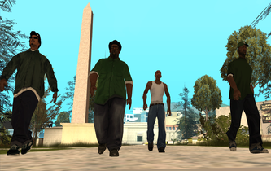

# kaolinhida.github.io

<html>
 <head>
  <title>Страница о снежном барсе</title>
 </head>
 <body>
  <h1>Снежный барс</h1>
  
 

 Гроув Стрит — афроамериканская уличная банда в городе Лос-Сантос, в отличие от остальных банд в штате. 
 Банда исповедует неприятие тяжёлых наркотиков и выступает против их распространения на своих территориях, 
 хотя торговля оружием и уличные стычки для членов банды — самое привычное дело. 
 Также по ходу банда всё больше вовлекается в такую деятельность, как убийства/заказные убийства, 
 а позже — ограбления, кражи со взломом/кражи, сутенерство. 

 

 Банда сформировалась в районе Гэнтон, примерно в 60-х годах, а возможно и ранее, 
 поэтому являются самой старейшей бандой в Лос-Сантосе. 
 Затем они заняли все соседние территории. А в Восточном Лос-Сантосе Гроув Стрит столкнулись с бандой Баллас, 
 которая в последствии стала их кровным врагом. 

 </body>
</html>
