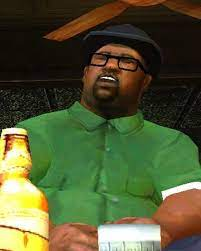
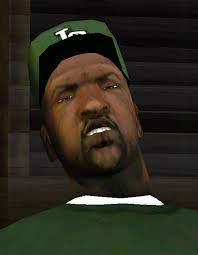
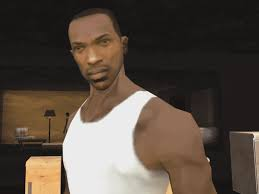
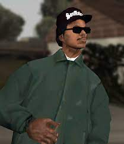

<html>
  <head>
  <link rel="stylesheet" href="styles.css">
</head> 
 <body>
  <h1>Гроув Стрит</h1>
  

  Гроув Стрит - организованная  афроамериканская преступная группировка. Одна из самых жестоких и многочисленных уличных банд Центральной и Северной Америки, которая активно действует практически на всей територии гетто. Является крупнейшей афроамериканской преступной группировкой Лос-Сантоса.
   
Группировка возникла в Лос-Сантосе в среде бедных афроамериканских районов, которые массово хлынули в организацию в начале 1960-х годов, спасаясь от нищеты и проблем в своей стране (к началу 1970-х годов только в Лос-Сантосе проживало около 4000 афроамериканцев, которые были участниками банды). Подвергаясь насилию со стороны других уличных банд они становились всё кровожаднее и бессердечнее. С ростом численности нищеты и расширением влияния у бедных районах стали появляться территориальные «филиалы» («клики»).
   
По разным оценкам, численность преступного синдиката колеблется от 50 до 40000 человек, включая ассоциированных участников. Согласно оценкам правоохранителей, в том числе ФБР, количество участников буйно растет и в 1980 годах, число участников перешагнуло 70000 человек.
   
Группировка Гроув Стрит официально была признана властями США «самой большой угрозой для США после Аль-Каиды». В октябре 1983 году Гроув Стрит стала первой уличной бандой, которую федеральные власти США признали «опаснишей бандой в США».
   
Гроув Стрит занимается многими видами преступного бизнеса, в том числе торговлей наркотиками, оружием и людьми; грабежами, рэкетом, заказными убийствами, похищениями людей с целью получения выкупа, сутенёрством, угонами автомобилей, отмыванием денег и мошенничеством. Многие уличные торговцы и небольшие магазины, расположенные на территориях Гроув Стрит, платят банде до половины дохода за возможность работать. Группировке вынуждены платить и многие проживающие в США афроамериканцы, родственников которых в случае отказа бандиты изувечат или убьют на родине (как на воле, так и в тюрьме). Но наибольшую прибыль Гроув Стрит получает от посредничества в наркоторговле или собирая дань за право торговать наркотиками на «своей» территории. Также на MS-13 замыкаются многочисленные команды воров, промышляющие в розничных сетях, небольших магазинах и аптеках.
   
Союзниками Гроув Стрит являются самая мощная тюремная банда США — Мексиканская мафия, а также мексиканские наркокартели Синалоа и Гольфо. Главным врагом группировки является другая крупная латиноамериканская преступная группировка — 18 Улица банд, также Гроув Стрит враждует с группировками Раклос (банда), Плейбойс (преступная группировка), Латин Кинг, Кровь, Пирус и Крипс. 

 
 <head>
  <meta charset="utf-8">
  <!--[if lt IE 9]>
   
  <![endif]-->
 </head>
 <body>
  <figure class="sign">
      <h1>Большой дым</h1>
   

  </figure>
  
 Большой дым родился в Лос-Сантосе, вероятно в гетто, из-за тесной связи со Свитом и Карлом Джонсонами, и позже он стал членом банды Гроув Стрит. Он поднялся по служебной лестнице банды, пока тот не стал правой рукой Свита, отъезд Карла в 1970 году после смерти его брата помогли Смоуку и Свиту развивать более тесные отношения.  

 
   </body>
   <head>
  <meta charset="utf-8">
  <!--[if lt IE 9]>
   
  <![endif]-->
 </head>
 <body>
  <figure class="sign">
      <h1>Свит Джонсон</h1>
   

  </figure>
  
 После того как в автокатастрофе гибнет его младший брат Брайан Джонсон, Карл покидает Лос-Сантос, улетев жить в Либерти-Сити, а Свит становится лидером банды. Под управлением Свита банда быстро слабеет и теряет авторитет в городе. Вражеские банды травят членов Гроув Стрит наркотиками. Вскоре банда Балласс развязывает войну за территории. Очень быстро Гроув Стрит теряет свои территории, проигрывая вражеской банде, в итоге банда Свита была загнана в последний район, свою родную улицу. После возвращения Карла, банда начинает набирать прежнюю мощь и становиться при совместном руководстве братьев, одной из самых влиятельных семей города Лос-Сантос. В 1973 году, Свита нашли мертвым на общегородском кладбище, возле могилы младшего брата. 

 </body>
   <head>
  <meta charset="utf-8">
  <!--[if lt IE 9]>
   
  <![endif]-->
 </head>
 <body>
  <figure class="sign">
      <h1>Свит Джонсон</h1>
   

  </figure>
  
 Карл Джонсон родился в Лос-Сантосе. Мать — Беверли Джонсон, отца Си-Джей никогда не знал и не упоминал вообще. Имеет двух братьев — старшего по прозвищу Свит, и младшего Брайана, а также сестру Кендл. Осенью 1971 года, Карл являлся лидером банды Гроув Стрит. Весной 1971 года, Карл начинает масштабные операции по возвращению территорий и влияния его банды в городе, налаживает отношения с маленькой семьей, которая связана с мексиканской мафией, через эти связи получает влиятельных друзей и открывает большие рынки наркотиков и оружия для своей семьи. В 1973 году теряет брата и начинает поиски убийцы, выходя на предателей в своей банде. Проделав чистку внутри банды и убив всех предателей, создает съезд семей и отходит от дел, отправляясь в Либерти-Сити. 

 </body>
   <head>
  <meta charset="utf-8">
  <!--[if lt IE 9]>
   
  <![endif]-->
 </head>
 <body>
  <figure class="sign">
      <h1>Райдер</h1>
   

  </figure>
  
 Райдер родился в Питроуне, в подростковом возрасте переехал в Лос-Сантос и там вступил в Гроув Стрит, из-за своей пристрасти к наркотикам и его обороту, стал главным дилером на подконтрольной территории банды. В 1971 году был замечен Большим дымом и стал его главным помощником. 

 </body>
   
 

  <h2> Фото из галерии Джеймса Кариона</h2>
  

 
   
   
    
    
    
    

 </body>
</html>
