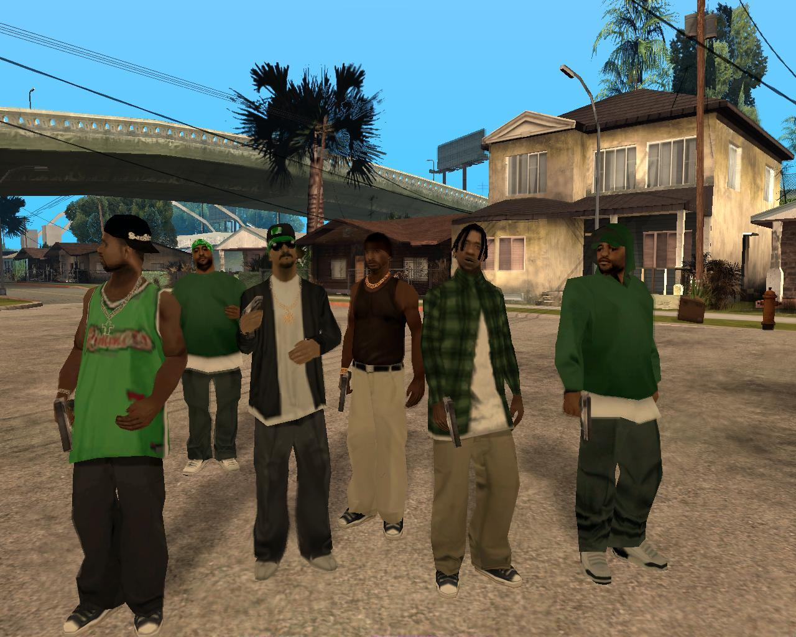
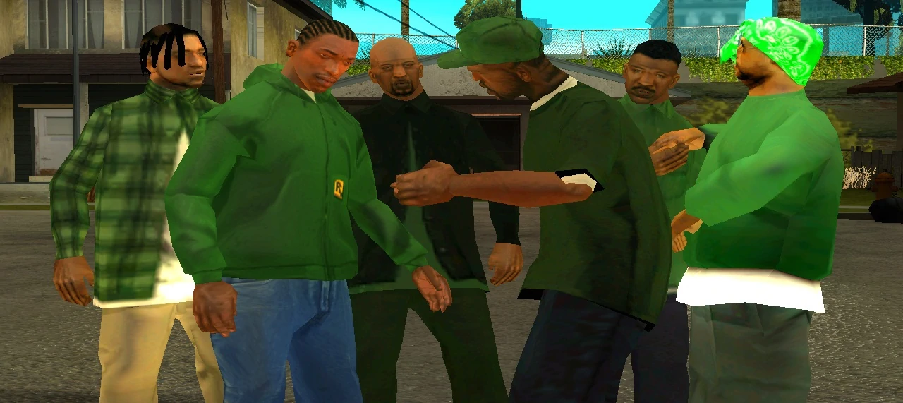
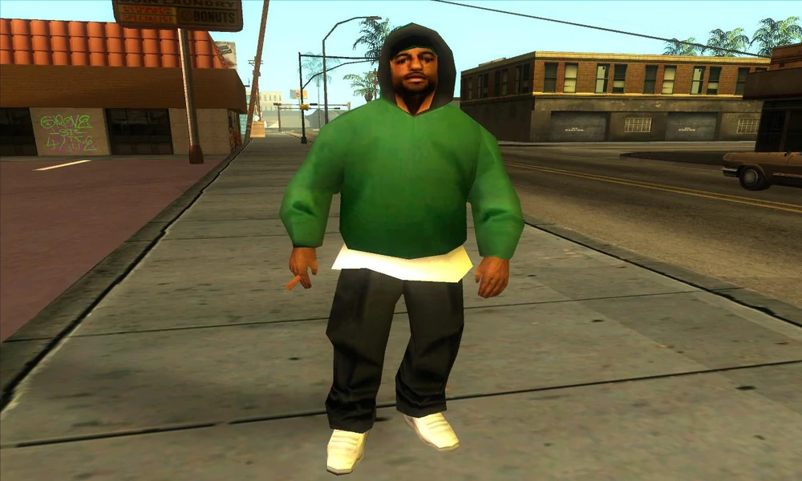
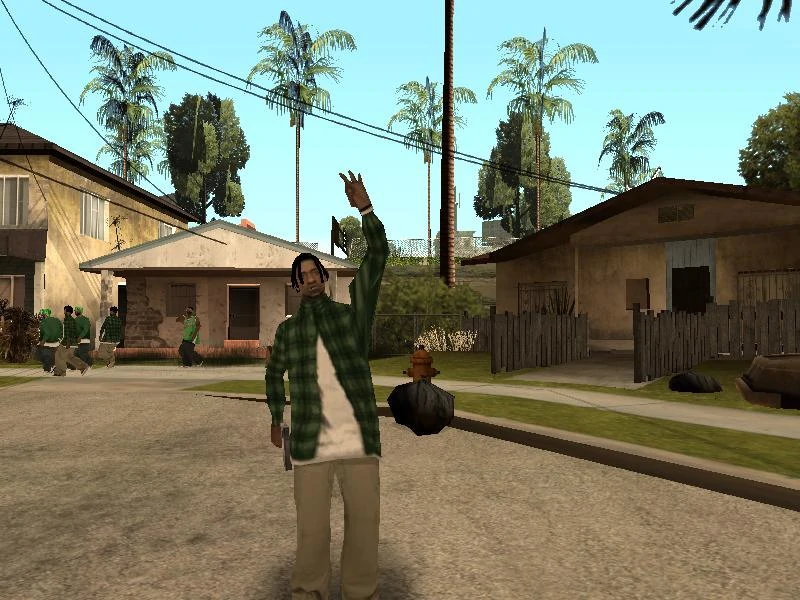
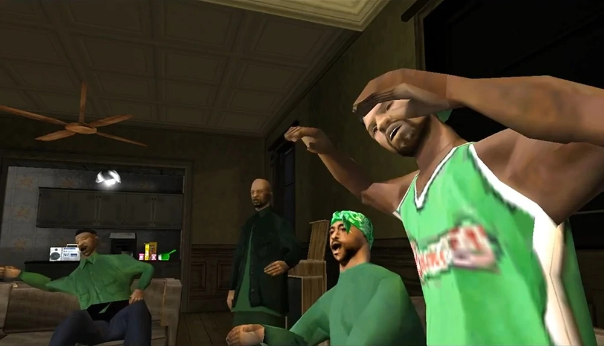

<html>
 <head>
  <link rel="stylesheet" href="https://maxcdn.bootstrapcdn.com/bootstrap/4.5.2/css/bootstrap.min.css">
 </head>
 <body>
  <h1>Гроув Стрит</h1>
  

  Гроув Стрит - организованная  афроамериканская преступная группировка. Одна из самых жестоких и многочисленных уличных банд Центральной и Северной Америки, которая активно действует практически на всей територии гетто. Является крупнейшей афроамериканской преступной группировкой Лос-Сантоса.
   
Группировка возникла в Лос-Сантосе в среде бедных афроамериканских районов, которые массово хлынули в организацию в начале 1960-х годов, спасаясь от нищеты и проблем в своей стране (к началу 1970-х годов только в Лос-Сантосе проживало около 4000 афроамериканцев, которые были участниками банды). Подвергаясь насилию со стороны других уличных банд они становились всё кровожаднее и бессердечнее. С ростом численности нищеты и расширением влияния у бедных районах стали появляться территориальные «филиалы» («клики»).
   
По разным оценкам, численность преступного синдиката колеблется от 50 до 40000 человек, включая ассоциированных участников. Согласно оценкам правоохранителей, в том числе ФБР, количество участников буйно растет и в 1980 годах, число участников перешагнуло 70000 человек.
   
Группировка Гроув Стрит официально была признана властями США «самой большой угрозой для США после Аль-Каиды». В октябре 1983 году Гроув Стрит стала первой уличной бандой, которую федеральные власти США признали «опаснишей бандой в США».
   
Гроув Стрит занимается многими видами преступного бизнеса, в том числе торговлей наркотиками, оружием и людьми; грабежами, рэкетом, заказными убийствами, похищениями людей с целью получения выкупа, сутенёрством, угонами автомобилей, отмыванием денег и мошенничеством. Многие уличные торговцы и небольшие магазины, расположенные на территориях Гроув Стрит, платят банде до половины дохода за возможность работать. Группировке вынуждены платить и многие проживающие в США афроамериканцы, родственников которых в случае отказа бандиты изувечат или убьют на родине (как на воле, так и в тюрьме). Но наибольшую прибыль Гроув Стрит получает от посредничества в наркоторговле или собирая дань за право торговать наркотиками на «своей» территории. Также на MS-13 замыкаются многочисленные команды воров, промышляющие в розничных сетях, небольших магазинах и аптеках.
   
Союзниками Гроув Стрит являются самая мощная тюремная банда США — Мексиканская мафия, а также мексиканские наркокартели Синалоа и Гольфо. Главным врагом группировки является другая крупная латиноамериканская преступная группировка — 18 Улица банд, также Гроув Стрит враждует с группировками Раклос (банда), Плейбойс (преступная группировка), Латин Кинг, Кровь, Пирус и Крипс. 

 
 

  <h2> Фото из галерии Джеймса Кариона</h2>
  

 
   
   
    
    
    
    

 </body>
</html>
